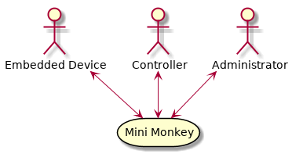

MiniMonkey
==========

[](https://travis-ci.org/Raphexion/minimonkey)
[](https://codecov.io/gh/Raphexion/minimonkey?branch=master)

MiniMonkey is a minimal message routing system.
Considerably smaller and simpler than MQTT.

It should be possible to implement a client in under one hour.

Three perspectives
------------------

When designing MiniMonkey we need to focus on our three users:

1. Users that want to primarily consume data and control devices
2. Devices that primarily will produce data and be be controlled
3. Administrators that needs to configure access controls



Design decisions
----------------

MiniMonkey is a publish / subscribe broker than only support routing keys.
Especially it does not implement topics.

MiniMonkey only cares about routing blobs.
Especially it does not use JSON / Protocol-buffers or other serialization.

MiniMonkey is designed around small payloads.
Moreover, the system should be "simple" enough that anyone can implement a client.

MiniMonkey uses stateful connections where previous _commands_ affect future commands. The reasons is to keep all payloads small.

All messages, both to and from the server follow a trivial binary protocol.

```
1 byte  : Function Code
2 byte  : Payload length
N bytes : Optional payload
```

Ports
-----

MiniMonkey uses two seperate ports.

| Port | Comment                             |
|-------|------------------------------------|
|  1773 | Users and Devices (binary protocol)|
| 11773 | Administrators (HTTP/REST)         |

The reason is that we can easily firewall the Administrators' port.
Moreover, we want to have clearn seperations of concerns in the server.

Function Codes
--------------

| Code | Comment                                                         |
|------|-----------------------------------------------------------------|
| 0x01 | Authenticate with token                                         |
| 0x02 | Set current routing key (persistent until changed or reconnect) |
| 0x03 | Publish binary payload                                          |
| 0x04 | Subscribe to current routing key                                |
| 0xEE | Error message                                                   |
| 0xFF | Debug message                                                   |

Examples
--------

A client logins in and publish 3 messages:

| Purpose          | Bytes          | Optional Payload         | Comment        |
|------------------|----------------|--------------------------|----------------|
| Auth with token  | 0x01 0x00 0x04 | 0x41 0x42 0x43 0x44      | Token: ABCD    |
| Pick routing key | 0x02 0x00 0x03 | 0x51 0x52 0x53           | Key: QRS       |
| Publish          | 0x03 0x00 0x04 | 0x01 0x02 0x03 0x04 0x05 | Binary payload |
| Publish          | 0x03 0x00 0x02 | 0xFF 0xEE                | Binary payload |
| Pick routing key | 0x02 0x00 0x04 | 0x51 0x52 0x53 0x032     | Key: QRS2      |
| Publish          | 0x03 0x00 0x01 | 0xAB                     | Binary payload |
